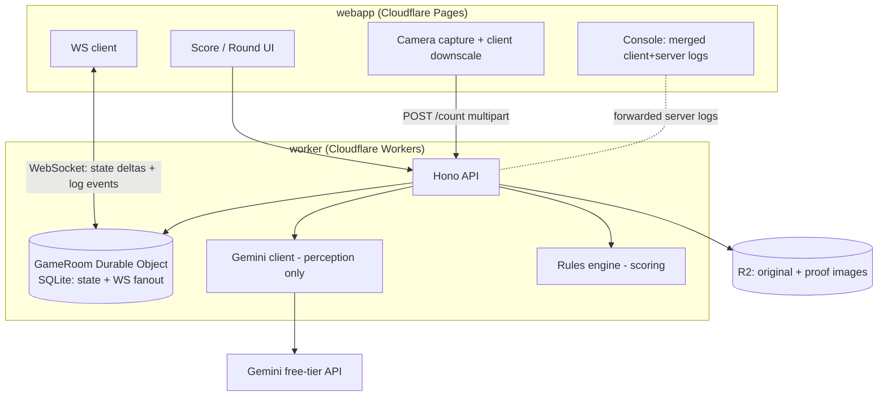

# 101 Companion — Design Spec

- **Status:** Approved (design), pre-implementation
- **Date:** 2026-07-03
- **Author:** Andrey Tsygankov + Claude
- **Related:** Stack/infra patterns adapted from the sibling `howler` repo.

---

## 1. Purpose

A mobile-first companion for the card game **101**. It does two jobs:

1. **Keep score** across rounds for all players, on multiple devices in sync.
2. **Count leftover cards** after each round from a **single photo** of the table, using a free-tier vision model (Gemini), and add the counted values to each losing player's score.

The game ends when a player reaches the score limit (default **101**); that player **loses**.

### 1.1 Scope (v1)

- The app is a **scorekeeper, not a referee**. It tracks scores and counts cards. It does **not** enforce play mechanics (skips, "+N to next player", trump selection, "can't end turn on 8"). Those effects on the reference sheet are the *play* rules; the app only needs the *counting* values.
- **Round end:** exactly one player finishes with no cards (scores 0 that round). Every other player's leftover cards are counted and added to their running score.
- **Game end:** first player to reach the score limit **loses**. Over-limit / exact-limit special rules are out of scope for v1 (kept simple, configurable later).
- **Deck:** 36-card (ranks 6→A) by default — the reference sheet starts at 6. Configurable per game.

### 1.2 Non-goals (v1)

- No player accounts / login (identity is ephemeral per game).
- No enforcement of turn order or legal moves.
- No native app / app-store distribution (responsive web only; no PWA/offline requirement).
- No AI arithmetic or AI rule-knowledge: the model only *perceives*; the app *scores*.

---

## 2. Reference: counting values (default ruleset)

From the physical reference sheet (bottom "counting" row):

| Rank | Value | Notes |
|------|-------|-------|
| 6 | +6 | |
| 7 | +7 | |
| 8 | +8 | |
| 9 | 0 | |
| 10 | +10 | |
| J | +2 | |
| Q | **suit-dependent** | Hearts −20, Spades −40, Clubs +3, Diamonds +3 |
| K | +4 | |
| A | +11 | |

Only **Q** needs suit recognition. All other ranks are suit-independent for scoring. (The top-row *play* effects — skip, +N to next player, choose trump, cannot end on 8 — are reference only and **not** modeled by the app.)

---

## 3. Product decisions (locked)

| Decision | Choice |
|----------|--------|
| Server role | **Full multi-device sync** — Durable Object per game, live score updates |
| Identity | **Ephemeral, no accounts** — join code + display name + rejoin token |
| Client platform | **Responsive web app** (mobile-first), Cloudflare Pages. No PWA/offline requirement |
| Rules | **Configurable at game creation** (data-driven rules engine) |
| Heap → player | **AI detects heaps + totals; user assigns** each heap to a player and confirms |
| Value scoring | **Worker computes** from rules config; **AI perceives only** |
| Proof image render | **Configurable** (`proofRenderMode`): worker always returns overlay JSON; when `server`, it also rasterizes a PNG into R2 |

---

## 4. Technology stack (mirrors `howler`)

- **Monorepo:** pnpm workspaces. **Node ≥20**, **pnpm** pinned via `packageManager`.
- **Language:** TypeScript, strict (`strict`, `noUncheckedIndexedAccess`, `exactOptionalPropertyTypes`).
- **schema** (`@101/schema`): Zod schemas + shared TS types + wire protocol + rules engine + `SCHEMA_VERSION`.
- **worker:** Hono on Cloudflare Workers; `GameRoom` **SQLite-backed Durable Object** (state + WebSocket fanout); **R2** bucket for images; **Gemini** client (free tier); structured JSON logging with server→client forwarding.
- **webapp:** React 18 + Vite, mobile-first responsive, Tailwind, TanStack Query for REST, a WebSocket client for live state, and a **Console** view. Deployed to Cloudflare Pages.
- **Testing:** Vitest everywhere; `@cloudflare/vitest-pool-workers` (miniflare) for the worker/DO/R2; Playwright E2E for the webapp.
- **CI/CD:** path-filtered GitHub Actions (typecheck + test + deploy) plus a **version-bump check** on PRs.

### 4.1 Repo layout

```
101-companion/
├── .github/workflows/        # deploy.yml, version-check.yml
├── docs/                      # specs, handoff.md (living), mermaid diagrams
├── schema/                    # @101/schema — shared package
├── worker/                    # Cloudflare Worker + GameRoom DO
├── webapp/                    # React + Vite client
├── scripts/                   # check_version_bump (adapted from howler)
├── package.json               # workspace root
├── pnpm-workspace.yaml
├── .gitignore .editorconfig
└── README.md
```

---

## 5. Architecture



Everything targets **free tiers**: Cloudflare Pages, Workers (free), SQLite-backed Durable Objects (free-plan eligible; verify at setup), R2 (free allotment), and Gemini free tier.

---

## 6. Domain & data model

### 6.1 Rules config (in `schema`, stored per game in the DO)

```ts
RulesConfig {
  scoreLimit: number            // default 101; reaching it => that player loses
  deck: Rank[]                  // default ["6","7","8","9","10","J","Q","K","A"]
  cardValues: Record<Rank, number>          // suit-independent values
  suitValues?: Partial<Record<Rank, Record<Suit, number>>>  // e.g. Q by suit
  proofRenderMode: "server" | "client"      // where the proof overlay is drawn
}
```

Pure scoring functions (unit-tested): `valueOf(card, rules)`, `heapTotal(cards, rules)`. `valueOf` resolves suit-dependent ranks via `suitValues` and returns an "unresolved" marker when a required suit is missing (surfaced to the user as an issue).

### 6.2 Game state (authoritative, in the `GameRoom` DO)

```ts
Game {
  id, joinCode, createdAt, status: "lobby" | "playing" | "finished"
  rules: RulesConfig
  players: Player[]                 // { id, name, joined, connected, score }
  rounds: Round[]                   // history
  currentRound?: Round
  loserId?: string                  // set when someone hits the limit
}
Round {
  index, winnerId?, status: "collecting" | "counting" | "review" | "applied"
  counts: Record<playerId, number> // finalized per-player leftover totals
  proof?: { imageKey?, overlay, heaps }  // last counting result under review
}
Player { id, name, token, score, connected }
```

Identity: a player joins with a **join code** + display name and receives a **rejoin token** (stored in `localStorage`) that maps back to their `Player` in the DO.

---

## 7. API & real-time protocol

### 7.1 REST (Hono, under `/api`)

| Method / Path | Purpose |
|---|---|
| `GET /api/health` | Health probe (returns component versions) |
| `POST /api/games` | Create game (rules in body) → `{ gameId, joinCode, hostToken }` |
| `POST /api/games/:id/join` | Join with name → `{ playerId, token }` |
| `POST /api/games/:id/count` | Multipart photo upload → counting result (see §8) |

### 7.2 WebSocket (to the `GameRoom` DO)

- `GET /api/games/:id/ws?token=…` upgrades to a WebSocket handled by the DO.
- On connect: server sends full `Game` snapshot + exchanges component versions.
- **Client → server** messages: `startRound`, `setWinner`, `confirmCounts` (heap→player assignments + finalized totals), `adjustScore` (manual correction), `nextRound`, `endGame`.
- **Server → client** messages: `state` (snapshot/delta), `log` (forwarded server log entry), `error`.
- Uses **hibernatable** WebSockets for free-plan cost efficiency.

Gameplay mutations flow through the DO so it stays the single source of truth and can broadcast to every connected device. The counting HTTP call is stateless-ish: the worker does the Gemini work, then hands the result to the DO to attach as `currentRound.proof` for all devices to review.

---

## 8. Counting pipeline (core feature)

```mermaid
sequenceDiagram
  participant U as User (round-ender's phone)
  participant W as Worker (Hono)
  participant G as Gemini
  participant R as R2
  participant DO as GameRoom DO
  U->>W: POST /games/:id/count (downscaled photo)
  W->>R: store original.jpg
  W->>G: image + structured-output prompt<br/>(identify rank/suit, box each card, group heaps, flag unreadable)
  G-->>W: JSON {heaps:[{box_2d, cards:[{rank,suit?,box_2d,conf}], unreadable:[...]}]}
  W->>W: rules engine → per-card value, per-heap subtotal, assign heap colors
  alt proofRenderMode = server
    W->>R: rasterize SVG overlay → proof.png
  end
  W-->>U: {heaps,colors,boxes,subtotals,issues, proofUrl?, overlay, logs[]}
  W->>DO: attach proof to currentRound (review)
  DO-->>U: broadcast "state" (all devices see the proof + proposed totals)
  U->>U: assign each colored heap → player; fix any unreadable/unresolved
  U->>DO: confirmCounts → add subtotals to scores
  DO-->>U: broadcast new scores; if a score >= limit, set loser, status=finished
```

### 8.1 Gemini request

- Model configurable via env var (`GEMINI_MODEL`, default `gemini-2.5-flash`).
- Uses **structured JSON output** (response schema) and returns **bounding boxes** (`box_2d = [ymin,xmin,ymax,xmax]`, normalized 0–1000). The worker rescales to pixel coordinates using the original image dimensions.
- Prompt constrains recognition to the configured deck ranks and asks the model to (a) group cards into spatial heaps, (b) return rank and — only where needed — suit, (c) list anything unreadable with a reason. **No values, no totals** from the model.

### 8.2 Worker post-processing

- Map each recognized card → value via `RulesConfig`. Compute per-heap subtotal.
- Assign a distinct color per heap (deterministic palette).
- **Issues** surfaced for the human to resolve before confirming: unreadable cards, low-confidence cards, and rank-needs-suit cases (e.g. a Q with unclear suit).
- Proof overlay: always return `overlay` JSON (heaps, colors, pixel boxes, subtotals). When `proofRenderMode = server`, also rasterize an SVG overlay to PNG and store in R2, returning `proofUrl`.

### 8.3 Testability

Gemini sits behind a `GeminiClient` interface. Tests inject **fixture responses** (recorded JSON); CI never calls the live API. The rules mapping, color assignment, overlay geometry, and issue detection are all deterministic and unit-tested.

---

## 9. Logging & server→client forwarding (required)

- Shared `LogEntry` shape in `schema`: `{ ts, level, msg, source, versions, corrId?, ...ctx }`.
- **Server:** structured JSON to `console` (Logpush-ingestable, Howler-style) **and** collected per request; returned as `logs[]` in HTTP responses and pushed as `log` messages over the WebSocket for async/broadcast events.
- **Client:** its own ring buffer of client-side entries; the **Console** view merges client + server logs chronologically, each line tagged with **source** and **component versions**.
- A **correlation id** links a client action to the server log lines it produced.

---

## 10. Versioning (required)

- **Three independently versioned components:** `webapp` (package.json `version`), `worker` (package.json `version`), `schema` (package.json `version`, re-exported as `SCHEMA_VERSION`).
- **All versions appear in logs.** Server log lines carry `{ worker, schema }`; client log lines carry `{ client, schema }`. On WebSocket connect both sides exchange versions; a `schema` major mismatch raises a visible warning.
- **CI enforcement:** a `version-check` workflow (adapted from Howler's `check_version_bump.py`) fails a PR that changes files under a component without bumping that component's version. Doc-only changes are exempt.

---

## 11. Testing strategy (required)

| Layer | Tooling | Coverage |
|---|---|---|
| `schema` | Vitest | Rules engine (values incl. Q-by-suit, totals, over-limit), Zod validation, protocol types |
| `worker` | Vitest + `vitest-pool-workers` (miniflare) | REST routes, `GameRoom` DO flow (create/join/round/score/finish), counting pipeline with **mocked Gemini**, R2 I/O, overlay geometry, log forwarding |
| `webapp` | Vitest | Score reducer, heap-assignment logic, Console merge/order, version display |
| `webapp` E2E | Playwright | create → join (2 devices) → count (mocked) → assign → score → game end |

---

## 12. Infrastructure & deployment (mirrors `howler`)

- **worker `wrangler.toml`:** `GameRoom` Durable Object binding + migration tag; R2 bucket binding; `[vars]` for `GEMINI_MODEL` + component versions; `GEMINI_API_KEY` as a **secret**; `[observability] enabled = true`.
- **webapp:** Cloudflare Pages (`wrangler pages deploy dist`), dev proxy `/api` → local `wrangler dev`.
- **GitHub Actions:** path-filtered jobs (typecheck, test, deploy worker, build + deploy Pages, E2E on PR previews) + `version-check` on PRs. Secrets: `CLOUDFLARE_API_TOKEN`, `CLOUDFLARE_ACCOUNT_ID`, `GEMINI_API_KEY`.
- **Secrets/env:** `.dev.vars` (gitignored) for local; no `.env` committed. `.gitignore`/`.editorconfig`/tsconfig mirrored from Howler.
- **Handoffs:** `docs/handoff.md` kept living; mermaid diagrams updated as the design evolves.

---

## 13. Error handling

- **Gemini failure / rate limit / timeout:** return a structured error + forwarded logs; the UI offers retry or **manual entry** (user types each player's leftover total). Manual entry is always available as a fallback so a bad photo never blocks scoring.
- **Unreadable / low-confidence cards:** never silently dropped — surfaced as issues that block confirm until resolved or manually overridden.
- **Version mismatch (schema major):** visible warning banner; app still functions best-effort.
- **Disconnect:** client auto-reconnects to the DO with its rejoin token and re-syncs the snapshot.

---

## 14. Open questions / future work (not v1)

- Over-limit / exact-101 special rules (e.g. bounce-back, halving) — configurable later.
- Play-effect enforcement (skips, trump, "can't end on 8") — out of scope; possible future "assistant" mode.
- Player accounts + cross-game stats/history.
- PWA/offline support.
- Multiple photos per round (currently one photo of the whole table).

---

## 15. Milestones (high level; detailed plan follows in writing-plans)

1. **Repo scaffold + infra:** workspaces, three components, tsconfig, CI, version-check, `.gitignore`, wrangler config, deploy pipeline — end-to-end "hello" deploy.
2. **schema:** rules engine + protocol types + `SCHEMA_VERSION` + tests.
3. **worker core:** `GameRoom` DO (create/join/round/score/finish) + WS fanout + logging/forwarding + tests.
4. **counting pipeline:** Gemini client + rules mapping + overlay/proof + R2 + tests (mocked Gemini).
5. **webapp:** score/round UI, camera capture, heap-assignment, Console, WS client + tests + E2E.
6. **polish:** error/fallback paths, version banners, handoff docs.
